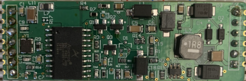
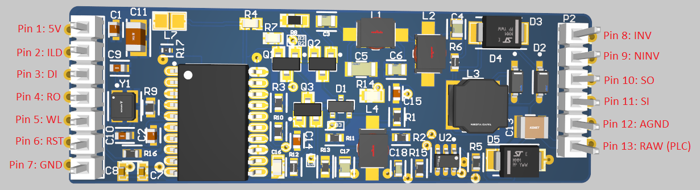
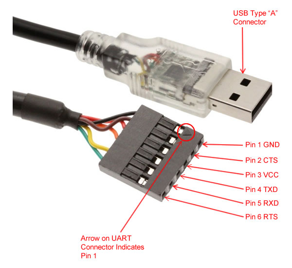
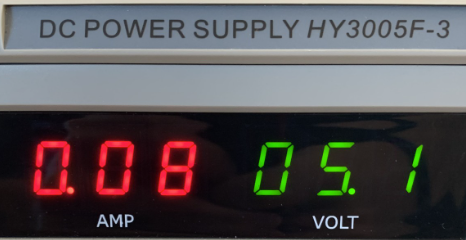
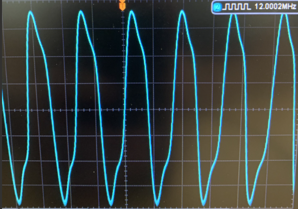
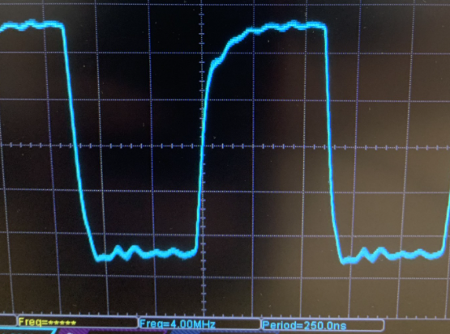
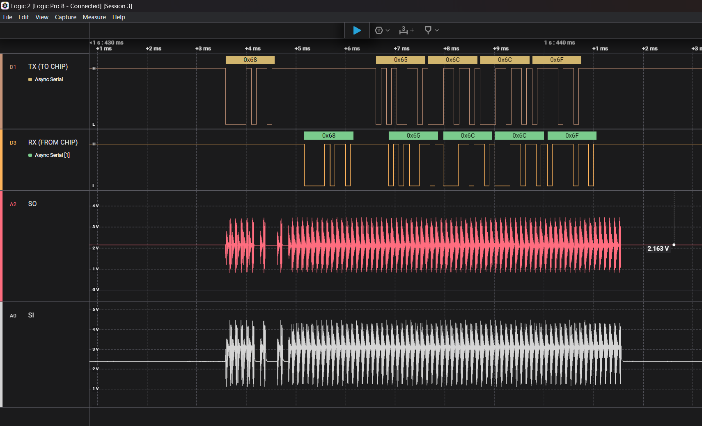

# SSC P485 Breakout Board Testing Guide

## Introduction

The **SSC P485 Breakout Board** is designed to interface with powerline communications systems in heavy vehicles. It plays a crucial role in maintaining signal integrity by housing a spread spectrum carrier chip (SSC P485 IC) and filtering components. This board is particularly optimized for integration with the **UTHP** Truck Cape, although it can act as a standalone device.

<p align="center">
  
</p>

## Table of Contents

1. [Materials Needed](#materials-needed)
2. [Pinouts](#pinouts)
3. [Initial Testing](#initial-testing)
4. [Further Testing](#further-testing)
5. [Validation and Verification](#validation-and-verification)
6. [Troubleshooting](#troubleshooting)
7. [Conclusion](#conclusion)

## Materials Needed

To successfully test the SSC P486 Breakout Board, you will need the following materials:

- **SSC P486 Breakout Board**
- **UTHP Module**
- Power supply (5V DC or as required for the UTHP)
- Breadboard
- Oscilloscope / Logic Analyzer
- UART Cable
- Multimeter
- Test cables and connectors

## Pinouts

As seen in the image below, the SSC P485 breakout board has 13 pins. The breakdown of these is as follows:

- **Pin 1: +5V**
  - Used to power the breakout board with 5V DC. Connect to UART cable pin 3 (VCC) for section 3.
- **Pin 2: ILD**
  - *Idle Line Detect* output of the SSC P485 chip. No connection unless debugging, in which it should be observed as low when data is sent over UART.
- **Pin 3: DI**
  - *Driver Input* digital input of the SSC P485 chip. Connect to UART cable pin 4 (TX) for section 3.
- **Pin 4: RO**
  - *Receiver Output* digital output of the SSC P485 chip. Connect to UART cable pin 5 (RX) for section 3.
- **Pin 5: WL**
  - *Word Length* digital input of the SSC P485 chip. No connection unless a different frame structure is desired. Logic 1 selects 10-bit frame, 0 selects 11 bit frame. Both types of frames contain a START and STOP bit.
- **Pin 6: RST**
  - *Reset* digital input of the SSC P485 chip. No connection unless debugging, in which a logical 1 will reset the SSC P485.
- **Pin 7: GND**
  - *Ground* which is VSS for the SSC P485 chip. Connect to UART Cable pin 1 (GND) for section 3.
- **Pin 8: INV**
  - *Inverting* testpoint of the output signal's operational amplifier filter. No connection unless debugging, in which it allows for analysis of the filtered PLC signal on the output side of the operational amplifier.
- **Pin 9: NINV**
  - *NonInverting* testpoint of the output signal's operational amplifier filter. No connection unless debugging, in which it allows for analysis of the partially filtered PLC signal before reaching the output of the operational amplifier.
- **Pin 10: SO**
  - *Signal Out* testpoint of the SSC P485 chip. No connection unless debugging, in which it allows for analysis of the unfiltered output PLC signal before reaching the filtering components.
- **Pin 11: SI**
  - *Signal In* testpoint of the SSC P485 chip. No connection unless debugging, in which it allows for analysis of the filtered input PLC signal before reaching the SSC P485 chip.
- **Pin 12: AGND**
  - *Analog Ground* which is GND for analog signals.
- **Pin 13: RAW / PLC**
  - *PLC* is the unfiltered signal input / filtered signal output of the breakout board used for connection and communication with a Powerline Communications network.

<p align="center">
  
</p>

<p align="center">
  
</p>
<p align="center">
Source: https://www.gearmo.com/shop/usb-to-serial-uart-5v-ttl-header-cable/
</p>

## Initial Testing

Follow these steps to set up the experimental environment:

1. **Connect the SSC P485 Breakout Board** to a breadboard using male header pins.
2. **Verify with a Multimeter** that 5V, amongst other signals, are not shorted to GND. Use section 2 (Pinout) as a reference.
3. **Power the Breakout Board** using a regulated power supply, ensuring the voltage output is 5V, with low current draw (seen below is ~80 mA).

<p align="center">
  
</p>

4. **Connect the Oscilloscope** to pins 1 and 5. Pin 1 should output 4 MHz, whereas pin 5 should output 12 MHz.

<p align="center">
  
</p>
<p align="center">
  
</p>

5. **Connect the UART Cable** to the SSC P485 breakout board. Follow the [Pinouts](#pinouts) section.
6. **Open a Terminal Emulator** such as [Putty](https://www.putty.org/) or [TeraTerm](https://teratermproject.github.io/index-en.html).
7. **Connect Via Serial** to the COM port that shows up, with a baud rate of 9600. To check which COM port is correct for the breakout board, open device manager, and unplug the USB to UART cable and see which COM port disappears, then plug back in.
8. **Send Messages** in your terminal emulator, and look for signals coming from the `RAW / PLC` pin on an oscilloscope.

## Further Testing

The testing procedure involves several key steps to ensure the board functions correctly with its parent board:

1. **Connect the Breakout Board**: Connect by either using headers, or soldering directly to the UTHP.
2. **Connect the RAW and GND signals to a PLC network**: This can be done through the banana jacks or through the DSUB15/Deutsch 9 pin with a J2497 adapter.
3. **Run the PLC code**: ```plc4trucksduck_host.py``` after following instructions on SSH'ing or logging into to the UTHP.

## Validation and Verification

To validate the performance of the SSC P485 Breakout Board:

1. Any logic analyzer can be used, for this test however, we used a [Saleae](https://www.saleae.com/)
2. Connect pins:
   - GND -> SSC P485 Pin 7 (GND)
   - Data 0 -> SSC P485 Pin 3 (DI / TX)
   - Data 1 -> SSC P485 Pin 4 (RO / RX)
   - Analog 0 -> SSC P485 Pin 10 (SO / Output Signal)
   - Analog 1 -> SSC P485 Pin 11 (SI / Input Signal)
3. When running the code, the logic analyzer output should show the following:
<p align="center">
  
</p>

   - The top waveform is the transmitted serial data (brown / TX)
   - The waveform second from the top is the received serial data (orange / RX)
   - The waveform second from the bottom is the transmitted analog PLC signal (red / SO)
   - The bottom waveform is the received analog PLC signal (white / SI)
   - When sending data, the circuit will "loop" the transmitted data back to the receiving end, which is what is displayed above. If your transmitted message is also received, then the circuit is working as intended.

## Troubleshooting

If the board does not perform as expected:

1. **Check Power Connections** to ensure stable and correct voltage is being supplied.
2. **Verify PCB Integrity** using a multimeter to ensure no shorts are present.
3. **Inspect Signal Path** for any loose connections.
4. **Verify Components** such as the spread spectrum carrier chip and filters are functioning correctly.
   - Pin 1 of the SSC P485 chip should output 4 MHz, and pin 5 should output 12 MHz.
5. **Consult Documentation** for both the SSC P486 and UTHP for any configuration nuances that may affect performance.

## Conclusion

This guide provides a structured approach to testing the SSC P485 Breakout Board. By following these steps, you can verify that the board meets its design specifications and is ready for deployment in tandem with the UTHP.
