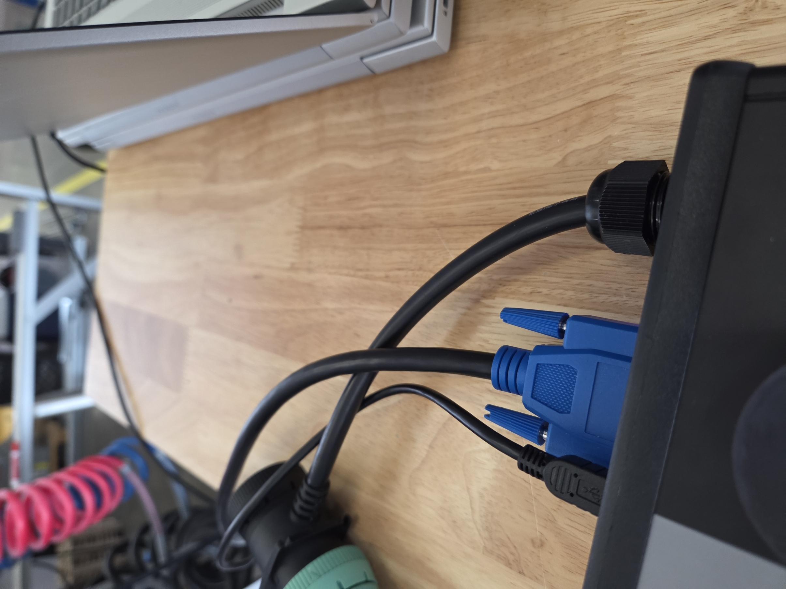
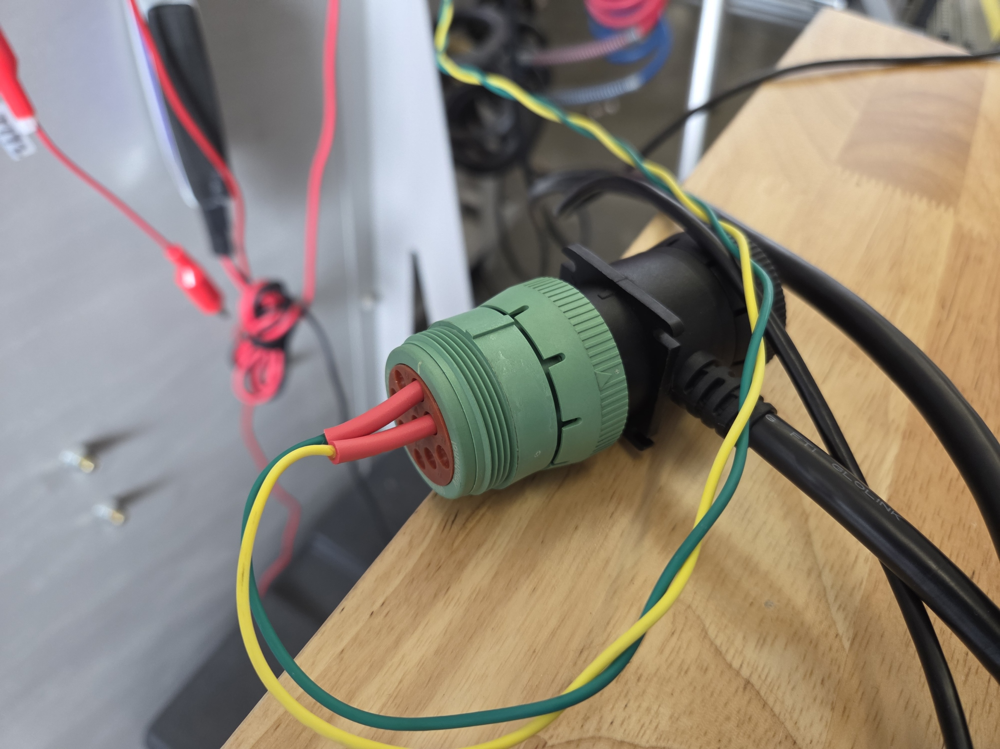
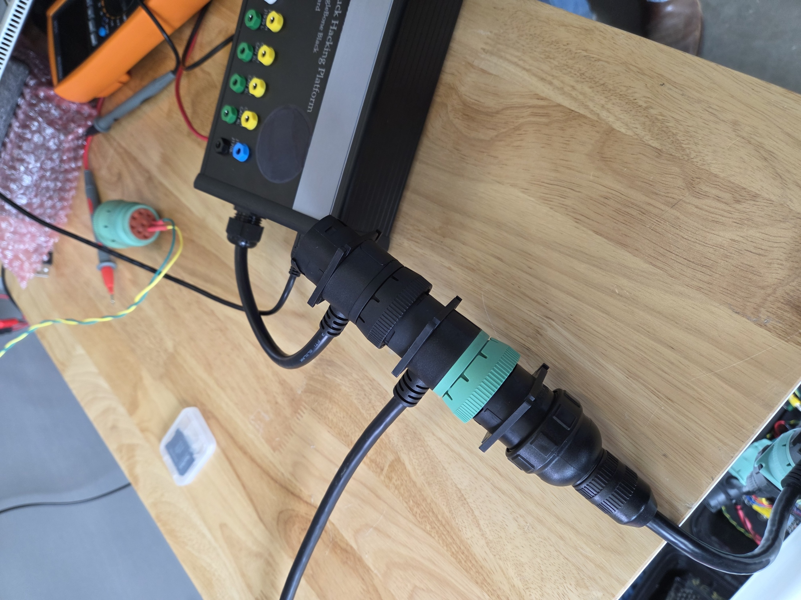

# Welcome to the UTHP test suite

The UTHP team put together a set of pytests to test the Yocto build of the UTHP (Ultimate Truck Hacking Platform) image. The tests are located in the `uthp-tests` directory of https://github.com/Spenc3rB/uthp-tests, and are run on the target device after the image has been flashed to the eMMC (embedded MultiMediaCard). This directory contains a copy of those tests for convenience.

## Prerequisites

Using this repository depends on a basic understanding of Linux commands and GitHub. Resources on how to use the Linux command line GitHub can be found [here](https://ubuntu.com/tutorials/command-line-for-beginners#1-overview) and [here](https://docs.github.com/en/get-started/quickstart).

### 1. Connect the UTHP to the network and power it on with the SD card inserted. 

>You may need to hold down the s2 button if another image is already flashed to the eMMC.

### 2. SSH into the UTHP
Using the USB Mini connection to a computer, log into the UTHP.
> This is stage 1
```bash
ssh root@192.168.7.2
```
> Don't worry, the root user will be locked, and the UTHP user will be added after the device has been flashed.

### 3. Generate the 'pre-production' image (i.e. the image that will be flashed to the eMMC)
> This updates user, permissions, and packages.

```bash
sudo emmc-flasher
```

Now you are ready to take the tests for a spin! Remove the SD card from the UTHP and power cycle the device.

## Running the tests

> The tests are seperated by core tests (i.e., common functionality of the UTHP), PLC tests (i.e., 12V RAW signal needed seperately to test the PLC), and remote tests (i.e., laptop connected over USB-OTG Ethernet). In this sense the uthp-tests can be parallelized to run 3 tests on 3 different devices at the same time, improving the efficiency of the testing process.

To parallize the tests for a more efficient production line, the following tests are compatible with each other and can be run on different devices at the same time:

- Core tests, and Remote tests
- PLC tests, and CAN0-2 tests

### 1. Set up the physcial testing space

Start by turning on the two battery chargers, then turn on both red safety switches on both the Cascadia and the Brake Board, which are reprentative heavy vehicle systems.

Then, make sure to charge the UTHP capacitors for safe-shutdown tests for at least 5 minutes, by plugging in the blue DSUB-15 connector (also referenced as the Brake Board in this document):



Grab a coffee or perform other unit tests on separate UTHPs while you wait.

This documentation refers to the Cascadia, and any reference to it's physical connection should look similarly to the following:



Finally, when performing software tests for can0-2, make sure to connect the Deutch-9 pin to the Truck-In-A-Box, as shown below:



#### 1.1 Install the required software on your local machine

```bash
sudo apt install python3 python3-pip python3-venv git make 
```
and then to install the required python packages:

```bash
pip install -r requirements.txt
```

If you are getting warnings, do not use a venv. Instead try installing the packages globally with apt:

```bash
chmod +x install-deps.sh
./install-deps.sh
```

### 2. SSH into the "pre-production" UTHPs

```bash
ssh uthp@192.168.7.2
```
> Password: 'UTHP-R1-XXXX' (where 'XXXX' is the last 4 digits of the UTHP serial number). 

*THIS PASSWORD IS TEMPORARY AND WILL BE
CHANGED IMMEDIATELY AFTER RUNNING `make production-ready`.*

### 3. Update the UTHP

```
python3 UpdateTHP.py
```

> Note: Version 1.0.4 requires when prompted with `Enter any additional commands here...` for you to enter the following command:

```bash
systemctl enable rename-can-itf
```
> and again when prompted with `Enter any additional commands here...` for you to enter the following command:

```bash
systemctl enable can-netdev-led
```

Then shutdown the uthp and disconnect the DSUB-15 and USB interfaces after typing in `shutdown now` in the command loop prompt (`Enter any additional commands here...`).

> Then press enter to end the command loop.

To ensure the UTHP is power cycled, the blue LED should be completely off before powering it back on. If the UTHP doesn't have safe-shutdown yet (the blue LED turns off imediately).

> If the update was successful, you should see TruckHacking OS v1.0.4, and the only files within the `/home/uthp` directory should be the `uthp-tests` directory. If not, run the update again, or move the files manually to their respective locations as shown in the updates.yaml file (csv format). You only have to reboot the UTHP if updating overlays.


### 3.1 Hardware Tests

Hardware tests can be run at any time before [Production ready](#6-production-ready) but should be performed before the software tests to catch hardware related issues early on. To perform the hardware tests, follow the instructions [here](https://github.com/SystemsCyber/UTHP/blob/main/Testing/Hardware/UTHPHardwareTesting_Physical.pdf). Afterwards, you are clear to mark the UTHP as passing the `hardware` test, in the QA log format explained later on.

### 4. Run the tests

ssh back into the UTHP. You should see the coresponding version number (see [./updates/updates.yaml](./updates/updates.yaml)) after you log in.

Core, PLC, and CAN0-2 tests are run from the UTHP image, so you can run them from the UTHP itself. The remote tests are run from another local machine connected via USB-OTG Ethernet (192.168.7.2).

#### 4.1 Understanding the test structure

```bash
cd uthp-tests
```

Take a look at the Makefile to see the available targets:

```bash
cat Makefile
```

You should have the following targets:
- `core-test`: Runs the core tests
- `plc-test`: Runs the PLC tests
- `can0-2-test`: Runs the CAN 0-2 tests
- `remote-test`: Runs the remote tests
- `reset`: Resets the UTHP tests *!!!This will wipe the logs dir!!!*
- `reset-remote`: Resets the remote tests *!!!This will wipe the logs dir!!!*
- `production-ready`: Cleans up the UTHP tests, ensures all services are disabled, and sets the password to expire for the uthp user
- `create-log-dir`: Creates a log directory for the test results (this is done automatically when you run the tests)

It's easiest to run two terminals. One you have ssh'd into with an active session, and another for running remote tests, updates, and other commands. Each test references the hardware it should be connected to, so make sure to have the correct hardware connected to the UTHP.

#### 4.2 Core tests:

> Note: The core tests have been verified on the Cascadia, but should be able to run on any network with CAN, and J1708.

This tests the following:

Software:
- can-utils
- cancat
- canmatrix
- cannelloni
- cmap
- ipython3
- j1939 kernel module
- jupyter lab
- pretty-j1939
- py-hv-networks
- python3-can
- python2.7
- real time clock
- rtl-sdr
- safe-shutdown
- scapy
- sigrok-cli
- tmux
- truckdevil

Hardware:
- Deutch-9 Pin can0 send and receive
- DSUB-15 J1708 send and receive

Let's run the core tests from *within* the UTHP:

```bash
sudo make core-test
```

#### 4.3 PLC tests:

> Note: The PLC tests have been verified on the Brake Board, but should be able to run on any network with PLC.

This tests the following:

Software:
- plc4trucksduck
- pretty-j1587

Hardware:
- PLC send and receive (VBatt+12v and GND)
- **NO DSUB-15 J1708**

Let's run the PLC tests from *within* the UTHP:

> Note: The PLC tests require the Brake Board to be power cycled. First run:

```bash
sudo make plc-test
```
> wait for `Environment setup should be complete... waiting for user to confirm hardware is ready.` and then power cycle the Brake Board. After that, you can hit any key to continue the tests.

#### 4.4 Remote tests:

This tests the following:

Software:
- TruckDevil Serial / TCP
- GRIMM J1708 Serial
- Serial Login
- SSH Login

Hardware:
- Deutch-9 Pin can0 send and receive
- DSUB-15 J1708 send and receive

> Note: For these tests you will need to clone the following from within the uthp-tests directory:
> 1. https://github.com/Spenc3rB/TruckDevil

```bash
sudo make remote-test
```
or if make is not installed on your system, you can simply run:

```bash
pytest ./remote/remote-testing.py
```

Please ensure the UTHP is connected to 500K baud on can0 for the remote tests.

> Note: To perform remote tests, you will need to clone the TruckDevil repo: `git clone https://github.com/Spenc3rB/TruckDevil` inside the uthp-tests directory.
> Side note: j1708 encoding is tested by looking at the encoding (which is encoded as a j1708 message) and then sending a message serially to the UTHP. The actual software could not be tested:
```bash
  File "/usr/local/lib/python3.12/dist-packages/j1708-1.0-py3.12.egg/j1708/pid_types.py", line 278, in <module>
  File "/usr/lib/python3.12/enum.py", line 595, in __new__
    enum_class = super().__new__(metacls, cls, bases, classdict, **kwds)
                 ^^^^^^^^^^^^^^^^^^^^^^^^^^^^^^^^^^^^^^^^^^^^^^^^^^^^^^^
  File "/usr/lib/python3.12/enum.py", line 271, in __set_name__
    enum_member = enum_class._new_member_(enum_class, *args)
                  ^^^^^^^^^^^^^^^^^^^^^^^^^^^^^^^^^^^^^^^^^^
  File "/usr/local/lib/python3.12/dist-packages/j1708-1.0-py3.12.egg/j1708/pid_types.py", line 67, in __new__
  File "/usr/lib/python3.12/enum.py", line 1145, in __new__
    raise TypeError("%r has no members defined" % cls)
TypeError: <flag 'BrakeSystemAirPressureLowWarningSwitchStatus'> has no members defined
```

#### 4.5 CAN0-2 tests:

> Note: The CAN0-2 tests have been verified on the Truck-In-A-Box, but should be able to run on any network with 12V CAN on the Deutch-9 Pin.

This tests the following:
Software:
- python3-can

Hardware:
- Deutch-9 Pin can0 send and receive
- Deutch-9 Pin can1 send and receive
- Deutch-9 Pin can2 send and receive

> Note: CAN4 is verified manually, by inspecting the bitmagic.

Let's run the CAN0-2 tests from *within* the UTHP:
```
sudo make can0-2-test
```

And after we have achieved success, we can submit the image as production-ready, but first...

### 5. Save the test results

> Note: Test results should be saved to the UTHP github repo: https://github.com/SystemsCyber/UTHP/tree/main/Testing/Software/assets/logs. The logs should be saved under a directory with the serial number of the UTHP. An example of the directory structure is shown in the [logs](https://github.com/SystemsCyber/UTHP/tree/main/Testing/Software/assets/logs) directory of the UTHP github repo.

Each test result should be **named respectively** to match the serial number and time of the test. Make sure to include all 4 test results (core, PLC, CAN0-2, and remote) in the same directory. The following walks you through the process:

#### 5.1 Clone the UTHP repo from *within* the uthp-tests directory

```bash
git clone git@github.com:SystemsCyber/UTHP
```

You will need to private key to pull or push remotely, or one of the student laptops.

#### 5.2 Copy the test results

> Make sure these are the most recent (all passing) test results.

```bash
cd UTHP/Testing/Software/assets/logs 
```
Make a new directory with the UTHP serial number:
> Note: you will need to change XXXX

```bash
mkdir UTHP-R1-XXXX
```
Then copy the `core`, `plc`, and `can0-2` test results:

```bash
scp uthp@192.168.7.2:/home/uthp/uthp-tests/logs/* ./UTHP-R1-XXXX
```

Finally copy the `remote` test results from your local machine to the UTHP repo:
```bash
 cp ../../../../../logs/*-remote-results.txt ./UTHP-R1-XXXX
```

**Please only include one of each log, or the most recent.**

Then open up a text editor and edit the `README.md` file to include the test results, along with your initials. You can continue to update this later if needed.

#### 5.3 Check the status of the repo

```bash
git status
```
and pull the latest changes from the repo:

```bash
git pull origin main
```
> You should see your changes in the `git status` output. If you see any merge conflicts, please resolve them before continuing.

#### 5.3.1 Push the test results to the UTHP repo

```bash
git add .
git commit -m "Added UTHP-R1-XXXX test results - <your initials>"
git push origin main
```

> Note: If you cannot push to the repo, please open an [issue](https://github.com/Spenc3rB/uthp-tests/issues) or ensure you have received a private key to push to the repo (`ssh-add ~/.ssh/<private_key>`).

### 6. Production ready

> WARNING: The following command will delete the uthp-tests dir and set the password to expire for the uthp user:
```bash
sudo make production-ready
```

Then run:

```bash
history -c
```

on the UTHP to clear the history.

Finally, pop open another terminal and ensure the passwd is expired for the uthp user. DO NOT SET A NEW PASSWORD. For example:

```bash
ssh uthp@192.168.7.2
uthp@192.168.7.2's password:
Last login: Sat Apr  5 03:28:57 2025 from 192.168.7.1
WARNING: Your password has expired.
You must change your password now and login again!
```

Ctrl+C to exit the SSH session. You are now finished testing the UTHP!

# Appendix
## Reset the UTHP tests

> This stops systemd services that take up the CPU and memory, and resets the UTHP to a clean state. If performed remotely it will clean the cache.

If you need to reset the UTHP tests, you can do so by running the following command:

```bash
sudo make reset
```
or if running remote tests:

```bash
sudo make reset-remote
```

## Stop custom services

From within the UTHP:

```bash
sudo make stop-services
```
or disable them completely:

```bash
sudo make disable-services
```
