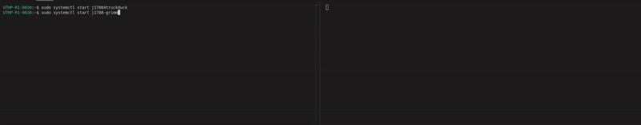

# UTHP Software Testing Artifacts

# Table of Contents
- [UTHP Software Testing Artifacts](#uthp-software-testing-artifacts)
- [Table of Contents](#table-of-contents)
  - [CMAP](#cmap)
  - [scapy-automotive](#scapy-automotive)
  - [python-can-j1939](#python-can-j1939)
  - [TruckDevil](#truckdevil)
  - [CanCat](#cancat)
  - [py-hv-networks and plc4trucksduck](#py-hv-networks-and-plc4trucksduck)
  - [pretty-j1587](#pretty-j1587)
  - [pretty-j1939](#pretty-j1939)
  - [sigrok and can2](#sigrok-and-can2)
  - [rtl-sdr](#rtl-sdr)
  - [tmux](#tmux)
  - [IPython3](#ipython3)
  - [python2.7](#python27)
  - [python3](#python3)
  - [Jupyter Lab](#jupyter-lab)
  - [canmatrix](#canmatrix)
  - [can-utils](#can-utils)
  - [TruckDevil Serial Port](#truckdevil-serial-port)
  - [GRIMM J1708 Serial Port](#grimm-j1708-serial-port)
  - [Login to the UTHP through SSH and Serial](#login-to-the-uthp-through-ssh-and-serial)
  - [UDP Server for Py-Hv-Networks](#udp-server-for-py-hv-networks)
  - [TCP Server for TruckDevil](#tcp-server-for-truckdevil)
  - [UDP Server for Canelloni](#udp-server-for-canelloni)
  - [Extras](#extras)
    - [Safe Shutdown](#safe-shutdown)
    - [LIN](#lin)
    - [100% bus load](#100-bus-load)
    - [j1708dump](#j1708dump)
    - [replay\_attack](#replay_attack)
    - [address\_claim\_attack](#address_claim_attack)
    - [boot\_times](#boot_times)
## CMAP

## scapy-automotive

## python-can-j1939

## TruckDevil

## CanCat

> Not yet ported to SocketCAN, this will be done in the future.

## py-hv-networks and plc4trucksduck

> This shows j1708dump (can't be run without py-hv-networks and plc4trucksduck_host.py or j17084trucksduck_host.py) and plc4trucksduck code ported to ti rpmsg driver (pru) on the UTHP.

## pretty-j1587

## pretty-j1939

## sigrok and can2

## rtl-sdr

## tmux

## IPython3

## python2.7

## python3

## Jupyter Lab

## canmatrix

## can-utils

## TruckDevil Serial Port

## GRIMM J1708 Serial Port

## Login to the UTHP through SSH and Serial

## UDP Server for Py-Hv-Networks

## TCP Server for TruckDevil

## UDP Server for Canelloni

## Extras

### Safe Shutdown

### LIN

### 100% bus load

[canbusload](./assets/zip/max_canbus_load.zip)

### j1708dump 

[j1708dump](./assets/zip/j1708dump.zip)

### replay_attack

[replay_attack](./assets/zip/replay_attack.zip)

### address_claim_attack

[address_claim_attack](./assets/zip/address_claim_attack.zip)

### boot_times

[debian](./assets/bootlogs/debian.log)

[yocto](./assets/bootlogs/yocto.log)