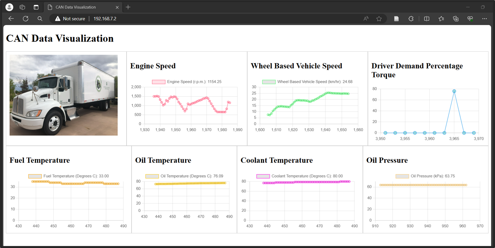

## Data Visualization Dashboard for BeagleBone Black

### Install NodeJS and Websockets

```
sudo apt update
sudo apt upgrade
curl -fsSL https://deb.nodesource.com/setup_14.x | sudo -E bash - &&\
sudo apt-get install -y nodejs
```
Create your project directory:
```
mkdir my-websocket-project
cd my-websocket-project
```
Initialize your Node.js Project:
```
npm init
```
Install necessary npm packages:
```
npm install ws
npm install socketcan
```
Keep everything default
Create you Websocket Server:
```
touch websocket_server.js
```
Your directory structure will look like:
```
/my-websocket-project
    /node_modules
    /public
        index.html
        styles.css
        client.js
    package.json
    websocket_server.js
```

### Build your Websocket Server

Add the websocket server code to your `websocket_server.js`. This will create a websocket server on port `8081` and listen to can messages, filter them by ID and forward them to the client for processing.

After your websocket server is configured correctly, run the websocket server:
```
node websocket_server.js
```

### Build your Client

The client will use the existing nginx service. Check if nginx is running;
```
sudo systemctl status nginx
```
Edit the nginx service configuration to remove the Cloud9 support. Open your Nginx configuration file in the `/etc/nginx/sites-available/` directory (typically named default or something specific to your site), find the Cloud9 location block:
```
location / {
    #Cloud9
    proxy_pass http://localhost:3000;
}
```
And comment it out:
```
#location / {
#    #Cloud9
#    proxy_pass http://localhost:3000;
#}
```
After making changes, save the file, and apply the changes by testing your Nginx configuration for syntax errors:
```
sudo nginx -t
```
If no errors are reported, reload Nginx to apply the changes:
```
sudo systemctl reload nginx
```
Remove index files from `/var/www/html/`. This will be any file with index, and create your own index.html and add the client code to it:
```
sudo rm -rf index.html
sudo nano index.html
```

### Check the Dashboard on the client PC:

Open up ip `192.168.7.2` on your client browser. You should see the dashboard:

  

